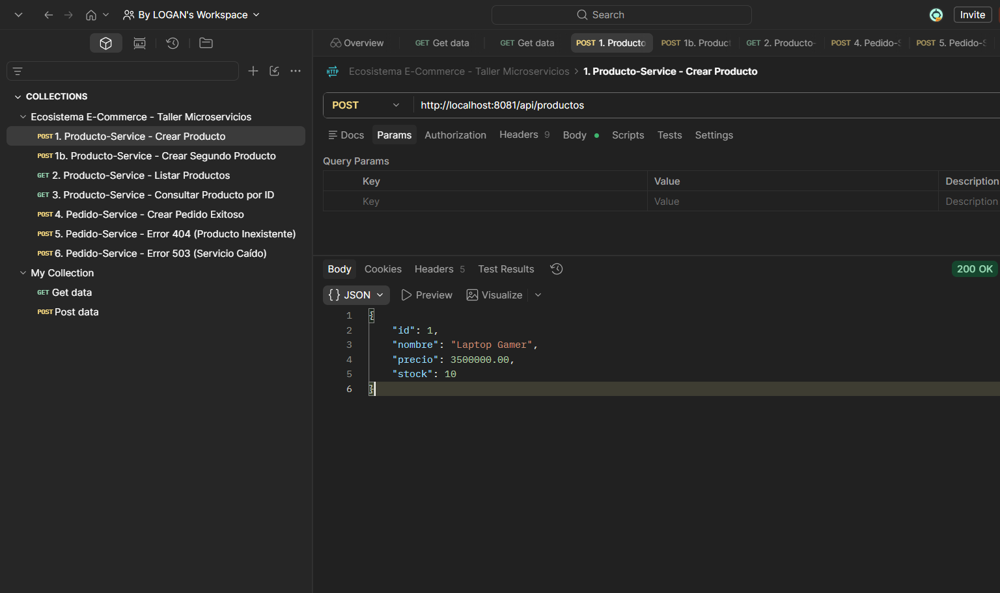
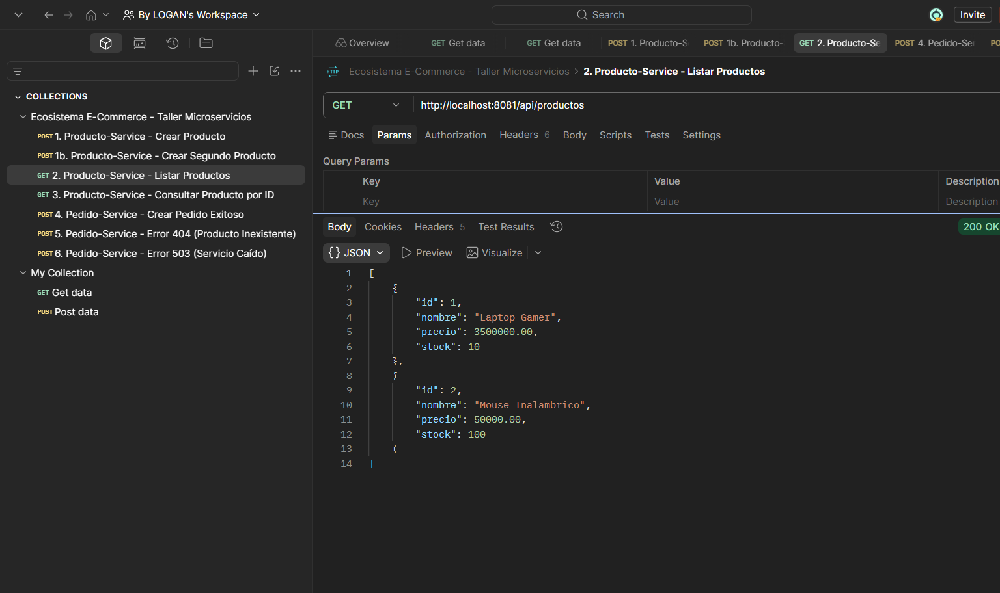
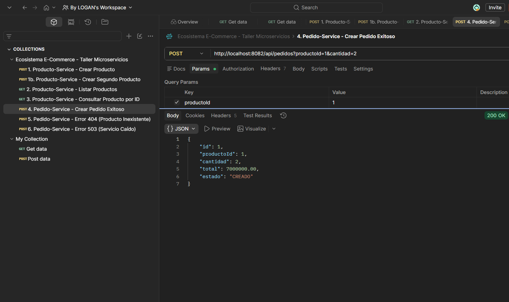
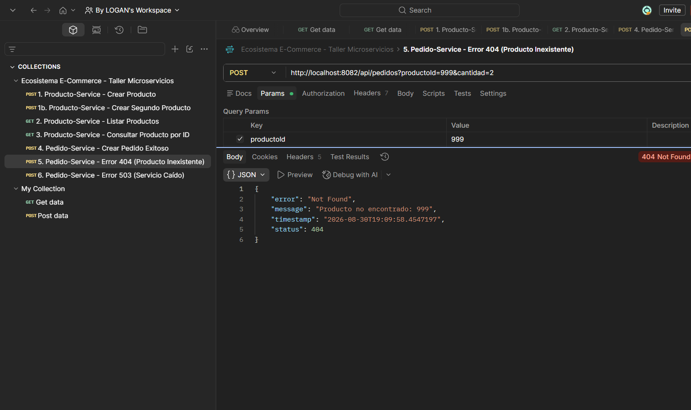
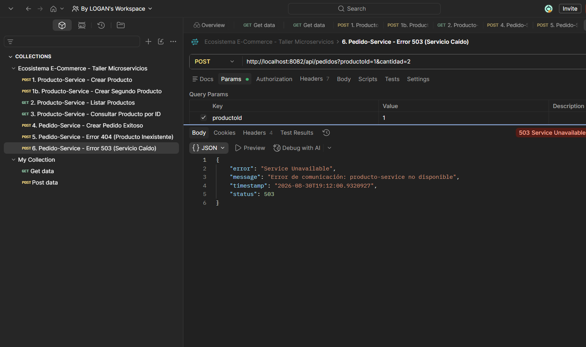

# Documento de Entrega — Taller Básico de Microservicios

**Electiva I: Arquitectura de Microservicios con Spring Boot** · Fundación Universitaria Tecnológico
Comfenalco · V Semestre · 2026-I

**Integrantes:** José Daniel Zambrano · Carlos Mario Bechara · Rafael Sarmiento Peña

> Código fuente, instrucciones de ejecución y capturas de las pruebas en Postman: ver
> [`README.md`](README.md).

---

### 1. ¿Qué responsabilidad tiene cada microservicio?

**`producto-service` (puerto 8081) — catálogo.** Es el dueño exclusivo de los productos: los crea, los
lista, los consulta por ID y expone sus existencias. Ningún otro servicio toca su base de datos
(`productodb`); quien necesite un producto debe pedírselo por HTTP.

**`pedido-service` (puerto 8082) — pedidos.** Es el dueño de las órdenes de compra. Al recibir un pedido
consulta a `producto-service` para verificar que el producto exista y obtener su precio, calcula
`total = precio × cantidad`, marca el pedido como `CREADO` y lo guarda en su propia base (`pedidodb`).

La separación se sostiene en dos decisiones: **cada servicio tiene su propia base de datos** y **la única
vía de contacto es HTTP**. Eso es lo que permite desplegarlos, versionarlos y escalarlos por separado.

---

### 2. ¿Qué pasaría si necesitáramos escalar solo `producto-service`?

Podríamos hacerlo sin tocar `pedido-service`, y es justo lo que conviene: en un e-commerce, la gente
consulta el catálogo muchísimo más de lo que efectivamente compra. Levantar tres o cinco instancias del
catálogo, dejando una sola de pedidos, aprovecha los recursos donde hace falta. Esa es la ventaja
concreta frente al monolito, donde para atender más consultas de productos habría que replicar
*también* toda la lógica de pedidos.

**Pero con el diseño actual no lo aprovecharíamos.** `pedido-service` apunta a una dirección fija,
`http://localhost:8081`, así que seguiría enviando el 100 % del tráfico a una sola instancia mientras
las demás quedan ociosas. Para que el escalado sirva haría falta un balanceador delante del catálogo, o
un registro de servicios que permita descubrir las réplicas y repartir entre ellas.

---

### 3. ¿Qué limitación notaron al tener la URL del otro servicio escrita en `application.yml`?

Que **acopla el servicio a una topología de red concreta**. En detalle:

1. **Hay que conocer host y puerto de antemano.** Si el catálogo cambia de dirección —otro servidor,
   otro puerto, un contenedor nuevo— hay que editar el archivo y reiniciar `pedido-service`.
2. **No hay balanceo de carga.** Una URL fija apunta a una sola instancia; no existe forma de repartir
   peticiones entre varias réplicas.
3. **No hay detección de caídas.** Si esa instancia muere, `pedido-service` sigue insistiendo contra una
   dirección muerta. Nuestro manejo de errores lo convierte en un `503` controlado, pero el servicio no
   puede reintentar contra otra instancia sana porque no sabe que existen.
4. **La configuración vive dentro del artefacto.** Cambiar un valor obliga a recompilar o redesplegar,
   y cada entorno (local, pruebas, producción) necesita su propia versión del archivo.

Estas tres limitaciones son exactamente el problema que resuelven los temas siguientes del curso:
**Config Server** (Semana 6) externaliza la configuración para no tener que reconstruir el servicio, y
**Eureka / Service Discovery** (Semana 7) elimina la necesidad de conocer host y puerto: `pedido-service`
pedirá el servicio por su nombre lógico, `producto-service`, y el registro le dirá qué instancias hay
disponibles en ese momento.

---

## Anexo — Evidencias de las pruebas en Postman

Ejecución de la colección `ecosistema_ecommerce.postman_collection.json` contra ambos microservicios
levantados en `localhost:8081` y `localhost:8082`. Cada captura muestra la petición enviada y la
respuesta real del servicio, con su código de estado y su cuerpo JSON.

**Prueba 1 — Crear producto.** `POST http://localhost:8081/api/productos` → `200 OK`,
`{ "id": 1, "nombre": "Laptop Gamer", "precio": 3500000.00, "stock": 10 }`

**Prueba 2 — Listar productos.** `GET http://localhost:8081/api/productos` → `200 OK` con los dos
productos registrados.

**Pruebas 3 y 4 — Crear pedido y verificar el total.**
`POST http://localhost:8082/api/pedidos?productoId=1&cantidad=2` → `200 OK`. El total se calcula con el
precio real obtenido de `producto-service`: `3 500 000,00 × 2 = 7 000 000,00`.

**Prueba 5 — Producto inexistente.**
`POST http://localhost:8082/api/pedidos?productoId=999&cantidad=2` → `404 Not Found` con el mensaje
`"Producto no encontrado: 999"`. El servicio responde de forma controlada, sin caerse.

**Punto de verificación clave — `producto-service` caído.** Con el catálogo detenido, la misma petición
devuelve `503 Service Unavailable` y el mensaje `"Error de comunicación: producto-service no disponible"`.
`pedido-service` sigue en pie.

